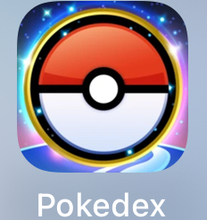

# PokeDex
**An IOS Application used as a Pokemon Tracker**

PokeDex is a simple app. Created to learn and improve my experience with embedded NavigationLinks, reactive changes, as well as more detailed displays.
PokeDex is an app used to track Pokemon, in an appealing way providing a way to track what Pokemon cards are captured, as well as what their evolutions are.

The app also persists the data, via JSON files; a user's captured Pokemon are saved and reloaded upon opening of the app.

#### Visual of App Functionality
This shows all of the apps functionality as well as persistence.

https://github.com/RoySchor/PokeDex/assets/70181314/0f13cee5-3fb1-4edd-81d0-8a2be4514c1d

